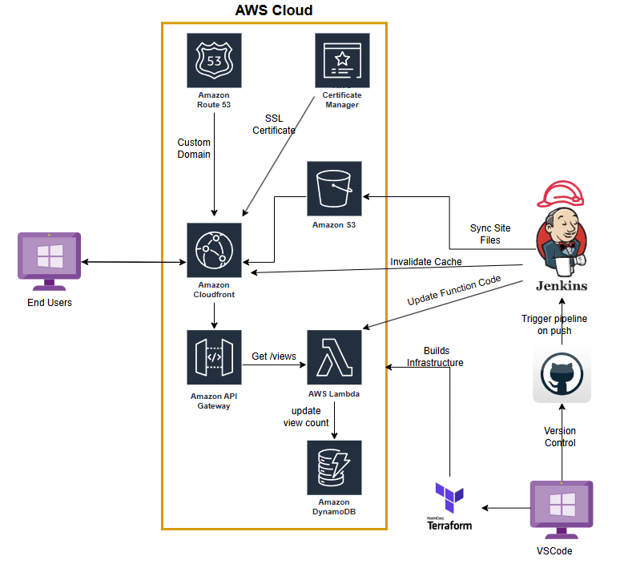

# Cloud Resume Project

---

## Technologies Used  
- AWS  
- Terraform  
- HTML / CSS / JavaScript  
- Python  
- Jenkins  
- GitHub
- Azure (for DNS/Hosting Jenkins)

---

## Useful Links
AWS Terraform Registry Documentation : https://registry.terraform.io/providers/hashicorp/aws/latest/docs
CloudFront Docs : https://docs.aws.amazon.com/cloudfront/
S3 Docs : https://docs.aws.amazon.com/s3/

---

## Security & Best Practices

1. **Keep Bucket Names Private**  
   Store bucket names in `terraform.tfvars` or `locals.tf` and `.gitignore` them. Public exposure can lead to brute force object discovery or abuse.

2. **Sanitize CloudFront Settings for Public Repos**  
   Remove overly specific configurations like TTLs, forwarded cookies, or detailed cache behavior. These can be exploited to disrupt or abuse traffic patterns.

3. **IAM Policies**  
   Always write your bucket policy in a separate `.json` or `.txt` file and exclude it from source control to prevent leaking ARNs or over-permissive settings.
   Its good practice to have policies follow the principal of least priviledge

4. **Use Modern TLS and HTTP/3**  
   When configuring SSL, use the latest security policy (e.g., `TLSv1.2_2021`) and enable HTTP/3 in your CloudFront distribution. No changes are needed on the bucket side.

5. **Implement Error Handling in Lambda**  
   Use `try/except` blocks or structured error handling in your Lambda functions to avoid silent failures and improve debugging.

---
# Architecture Diagram

---

## How-To Guide

### Step 1: GitHub and Terraform Setup  
Create a new GitHub repository to manage your source code with version control. Clone this repository locally to organize your Terraform files, scripts, and other resources. This repo will also integrate with Jenkins later for automated deployments.

### Step 2: S3 Bucket Creation  
Use Terraform to provision an S3 bucket for hosting your static site assets (HTML, CSS, JavaScript). Keep static website hosting **disabled** since CloudFront will handle content delivery.  
*Note:* While it’s good practice to use a separate bucket for Terraform state files, for solo projects it’s acceptable to keep the state locally.

### Step 3: CloudFront Distribution Setup  
Configure CloudFront via Terraform to use your S3 bucket as the origin. Enable Origin Access Control (OAC) to restrict bucket access exclusively to CloudFront. Set viewer protocol policy to redirect all HTTP traffic to HTTPS, preparing for SSL certificate integration.

### Step 4 Purchase Domain and SSL Cert
Next we want to a custom domain name instead of just the cloudfront domain name. We can purchase a domain for as little as 12$ from Route 53. We can then use AWS Certificate Manager to generate an SSL certificate. To validate it we need to add the CNAME records to our hosted zone. I use Azure to host my DNS records for my domains and terraform to create the records but you it may be simpler to just use AWS for and add the records via the console.
*Note:* The SSL Cert needs to be requested in the North Virginia Region to work with CloudFront

### Step 5 Integrating our new Domain and SSL Cert with CloudFront
Right, now that we have our domain and SSL certificate all ready, lets now use these for our CloudFront distribution. We'll head over to where we our hosting our DNS recordsets and create a new CNAME record and link it to our distributions domain name. Again we'll use terraform to create this record. We'll need to edit our cloudfront distribution as well and add and alias that matches our new domain name.

### Step 6 View Counter Setup (Optional Step)
Later on when we start coding our resume, we're going to want to know how many people viewed our website. To get started we'll create a DynamoDB table to store our view count.
To actually update the table we're going to use Lambda and a little python scripting. We'll create the python script in our repo so we have version control and can easily re-use for other projects if we wanted to. I've included a copy of the python script I created and have tried to include as many notes as possible for those who may be new to scripting.
*Note:* I'd reccomend using the **Pay Per Request** billing mode as it'll save some money if you don't expect a ton of traffic. Also keeps the table scalable.

### Step 7 View Counter Permissions and Lambda function (Optional Step)
Okay, now that we have our script, we need to create the Lambda function itself. We'll go ahead and create that using Terraform, as well as a new IAM role for the function.  
We'll need to give it the ability to:
- Assume the role of the Lambda service
- Access `GetItem`, `PutItem`, and `UpdateItem` actions for our DynamoDB table
- Write logs to CloudWatch (CreateLogGroup, CreateLogStream, PutLogEvents)

All of this will be handled with a Terraform IAM policy document. API Gateway is the next bit we're going to tackle.

### Step 8 API Gateway Setup (Optional Step)
We need an API Gateway as a way to trigger our Lambda function. We'll use a REST HTTP endpoint and configure CORS on it so our domain can call this API.  
The reason for configuring CORS is that we **only want our domain** to be able to call this API.  
When coding our resume later, we'll add a bit of JavaScript to fetch this API and display the view count on our resume site.

### Step 9 Pipeline Setup
Now that all of our infrastructure is set up, we want a way to automatically update our bucket whenever we make a change to our HTML.  
We'll set up a simple pipeline to do this. Jenkins or GitLab are both good tools for handling this. I already have Jenkins set up for other projects so I'm going to stick with that.

There’s a little bit of setup if you haven’t used a pipeline before:
- Generate some SSH keys
- Create a webhook for our GitHub repo
- Split out our Terraform and HTML into separate folders (`/infrastructure` and `/site`)
- Create a Jenkins pipeline that only syncs the `/site` folder to S3 on update

If you’re hosting Jenkins on AWS, it’s best to use an **IAM Role** with an **EC2 Instance Profile** for permissions.  
Since I’m hosting Jenkins in Azure, I created a new **IAM user** with programmatic access for Jenkins and gave it only the permissions it needs.

*Note:* Your Jenkins IAM user/role should always follow the **principle of least privilege**. 
---

